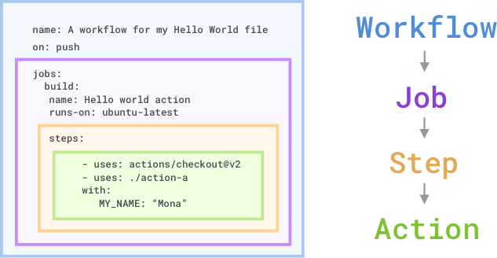

## [Github Actions - by Microsoft Learn](https://learn.microsoft.com/en-us/collections/n5p4a5z7keznp5)
- [ ] Automate development tasks by using GitHub Actions(AutomateDT)
- [ ] Build continuous integration (CI) workflows by using GitHub Actions(BuildCI)
- [ ] Leverage GitHub Actions to publish to GitHub Packages(LeveragePGA)
- [ ] Create and publish custom GitHub actions(CreateandPublish)
- [ ] Build and deploy applications to Azure by using GitHub Actions(DeplyoGA)
- [ ] Manage GitHub Actions in the enterprise(Manage)

## Concepts
